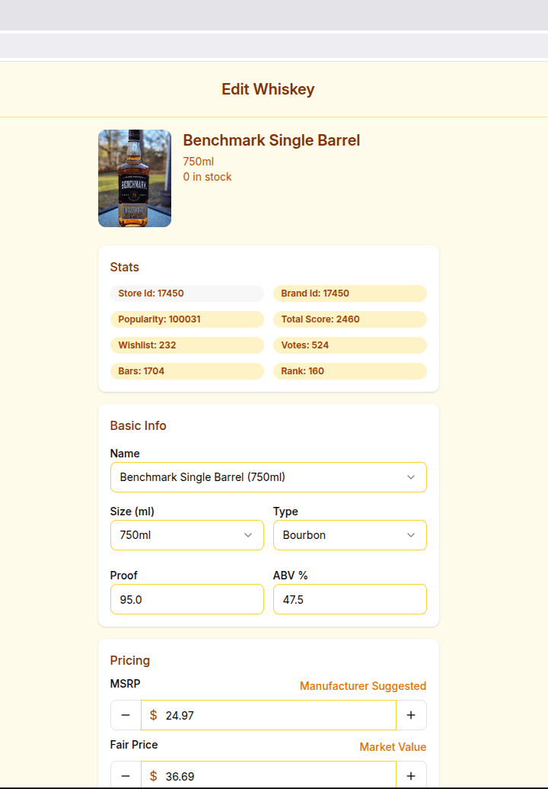

# Whiskey Goggles


This is my submission for the [Baxus Whiskey Goggles Bounty](https://earn.superteam.fun/listing/whiskey-goggles/).

<div align="center">
<table>
  <tr>
    <td align="center"></td>
    <td width="24"></td>
    <td align="center"></td>
    <td width="24"></td>
    <td align="center"></td>
  </tr>
  <tr height="12"></tr>
  <tr>
    <td align="center"></td>
    <td width="24"></td>
    <td align="center"></td>
    <td width="24"></td>
    <td align="center"></td>
  </tr>
</table>
</div>

---

##  Background

I came across [Superteam Earn](https://earn.superteam.fun) where people can tackle bounty challenges for real-world projects, and I thought it would be fun to try one. This codebase is the result of that adventure.

The challenge:

> _"Develop a computer vision system that can scan whisky bottle labels and match them to BAXUS's database of 500 bottles, allowing users to quickly identify bottles and record pricing information at liquor stores."_

---

##  My Process

### 1. Data Collection

#### a. Scraping

The [provided dataset](https://docs.google.com/spreadsheets/d/1sW-CJhdpAdXwCVkPo3J-zpmIjLAyVtyVYwkvoLPzr9w/edit?usp=sharing) only included a single image per bottle. To build something useful, I scraped the web for more.

Scraping code is in [`scraper.py`](https://gist.github.com/cletusigwe/e4c6b30c43fa8563fc574452d18cd011) (Gist).

#### b. Filtering

To clean up the dataset, I built a small [image filtering UI](https://whiskey-goggles-filter.malantir.com).

<div align="center">
  <table>
    <tr>
      <td align="center"></td>
      <td width="5"></td>
      <td align="center"></td>
      <td width="5"></td>
      <td align="center"></td>
    </tr>
  </table>
</div>

---

### 2. Model Training

I trained a classifier based on [`siglip-base-patch16-224`](https://huggingface.co/docs/transformers/main/en/model_doc/siglip), which is a part of the **SigLip** multimodal family. I initially explored [`moondream2`](https://huggingface.co/vikhyatk/moondream2), but it wasn’t built for direct classification.

Training was done on Google Colab. Code is in [`train.py`](https://gist.github.com/cletusigwe/e4c6b30c43fa8563fc574452d18cd011). Final accuracy was ~60%, which was sufficient for my prototype.

The data used to train the model can be found in this [Google Drive ZIP](https://drive.google.com/file/d/1IZdqRWjzVM5acwfhpxi3UQtC5Lx_3rDr/view?usp=sharing).

**Note:** Model files live in:
storage/app/onnx/

They’re large binary files tracked via **Git LFS**, so be sure to have LFS installed (`git lfs install`) before cloning.

---

### 3. Web App

I wrapped everything into a [live demo webapp](https://whiskey-goggles.malantir.com) where users can:

- Upload bottle images
- Classify and edit their metadata
- Help improve the dataset over time

Here’s a [demo video on YouTube](https://youtu.be/cGOc8Ps28Ko).

---

##  Getting Started

This app uses **Laravel + Inertia.js + React + TailwindCSS**.

```bash
# Clone the repo
git clone https://github.com/cletusigwe/whiskey-goggles.malantir.com.git
cd whiskey-goggles.malantir.comwhiskey-goggles

# Make sure Git LFS is installed and pulls the model files
git lfs install
git lfs pull

# Set up Laravel
./setup.sh    # this handles .env, migrations, deps etc.

# Run frontend dev server
composer run dev

# App runs at http://localhost:8000
```

